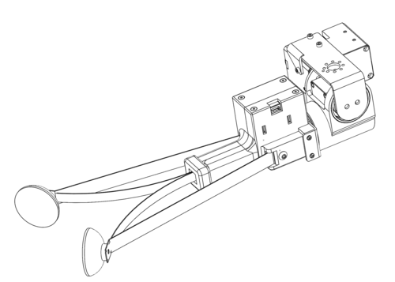

# Stretch RE1: Dex Wrist Tutorial

In this tutorial we will cover the installation, configuration, and use of the Stretch Dex Wrist.




## Overview

The Stretch Dex Wrist is an optional add-on to the RE1. It adds pitch and roll degrees of freedom to the standard wrist yaw joint. It includes a slighly modified version of the standard Stretch Compliant Gripper. 

**NOTE:** If your robot did not ship with the Stretch Dex Wrist pre-installed you will want to first proceed to the Appendix: Installation and Configuration at the end of this tutorial. 

## Working with the Dex Wrist

### Safe Use

The Dex Wrist requires added attention to safety. The added dexterity of the wrist increases the opportunities for self-collisions of the robot with its tool. It also adds additional pinch points around the pitch and roll degrees of freedom.

[Image: Pinch points / Collision points]

With Stretch Body v0.1.0 we introduce a rudimentary collision avoidance behavior. This

## Appendix: Installation and Configuration

### Hardware Upgrades

Earlier production 'batches' of Stretch will require a hardware upgrade prior to use the Dex Wrist. To check your robot's batch, run:

```bash
>>$ stretch_about.py
```

, and note the listed Batch Name.

| Batch Name        | Upgrade Wacc Board | Update Baud Rate |
| ----------------- | ------------------ | ---------------- |
| Guthrie           | Y                  | Y                |
| Irma              | Y                  | Y                |
| Hank              | Y                  | Y                |
| Joplin            | N                  | Y                |
| Kendrick or later | N                  | N                |

If your robot requires a Wacc Board upgrade please follow the [instructions here](https://github.com/hello-robot/stretch_factory/tree/master/updates/013_WACC_INSTALL) with the assistance of Hello Robot support. This must be done before attaching the Dex Wrist to our robot.

If your robot does not yet have a Dex Wrist installed, please follow the [instructions here](https://github.com/hello-robot/stretch_factory/blob/master/updates/015_DEX_WRIST/README.md) before proceeding.

### Software Configuration

Robots that did not ship with the Dex Wrist pre-installed will require their software to be updated and configured.

#### Upgrade Stretch Body

Ensure the latest version of Stretch Body and Stretch Factory are installed

```bash
>>$ pip2 install hello-robot-stretch-body -U
>>$ pip2 install hello-robot-stretch-body-tools -U
>>$ pip2 install hello-robot-stretch-factory -U
```

#### Update Servo Baud Rates

If your robot's batch requires a baud rate update:

```bash
>>$ RE1_dynamixel_set_baud.py /dev/hello-dynamixel-head 11 115200
---------------------
Checking servo current baud for 57600
----
Identified current baud of 57600. Changing baud to 115200
Success at changing baud

>>$ RE1_dynamixel_set_baud.py /dev/hello-dynamixel-head 12 115200
---------------------
Checking servo current baud for 57600
----
Identified current baud of 57600. Changing baud to 115200
Success at changing baud

>>$ RE1_dynamixel_set_baud.py /dev/hello-dynamixel-wrist 13 115200
---------------------
Checking servo current baud for 57600
----
Identified current baud of 57600. Changing baud to 115200
Success at changing baud
```

#### Configure User YAML

The Dex Wrist requires a number of updates to the robot user YAML

YAML doesn't allow definition of multiple fields with the same name. Depending on what is already listed in your user YAML you will need to manually merge fields. 

Merge the following additions to you your  `~/stretch_user/$HELLO_FLEET_ID/stretch_re1_user_params.yaml`

```yaml

params:
  - stretch_tool_share.stretch_dex_wrist_beta.params

end_of_arm:
  tool: tool_stretch_dex_wrist

robot:
  use_collision_manager: 1

stretch_gripper:
  range_t:
    - 0
    - 6667
  zero_t: 3817

lift:
  i_feedforward: 0.75

hello-motor-lift:
  gains:
    i_safety_feedforward: 0.75

```

#### Configure for use in ROS

First pull down the latest Stretch ROS, Stretch Tool Share, and copy in the URDF data:

```bash
>>$ cd ~/catkin_ws/src/stretch_ros/
>>$ git pull

>>$ cd ~/repos
>>$ git clone https://github.com/hello-robot/stretch_tool_share
>>$ cd stretch_tool_share/tool_share/stretch_dex_wrist/stretch_description
>>$ cp urdf/stretch_dex_wrist_beta.xacro ~/catkin_ws/src/stretch_ros/stretch_description/urdf
>>$ cp meshes/*.STL ~/catkin_ws/src/stretch_ros/stretch_description/meshes
```

Now configure `stretch_description.xacro` to use the DexWrist:

```bash
>>$ nano ~/catkin_ws/src/stretch_ros/stretch_description/urdf/stretch_description.xacro
```

 and edit to read,

```bash
<?xml version="1.0"?>
<robot xmlns:xacro="http://www.ros.org/wiki/xacro" name="stretch_description">
  <xacro:include filename="stretch_dex_wrist_beta.xacro" />
  <xacro:include filename="stretch_main.xacro" />
  <xacro:include filename="stretch_aruco.xacro" />
  <xacro:include filename="stretch_d435i.xacro" />
  <xacro:include filename="stretch_laser_range_finder.xacro" />
  <xacro:include filename="stretch_respeaker.xacro" />
</robot>
```

Update your URDF and then export the URDF for Stretch Body to use  (you may need to Ctrl-C to exit `rosrun`)

```bash
>>$ rosrun stretch_calibration update_urdf_after_xacro_change.sh
>>$ cd ~/catkin_ws/src/stretch_ros/stretch_description/urdf
>>$ ./export_urdf.sh
```

## 

.<div align="center"> All materials are Copyright 2020 by Hello Robot Inc. The Stretch RE1 robot has patents pending</div>
