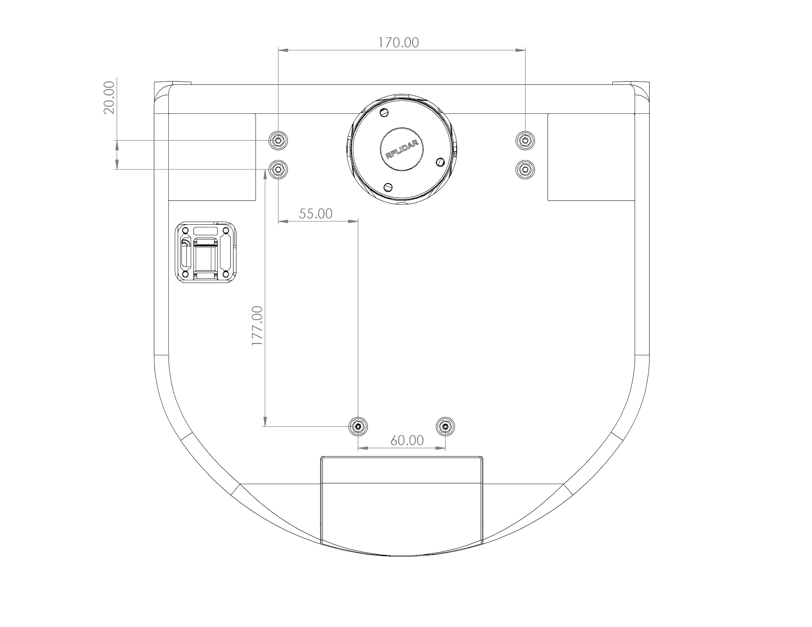
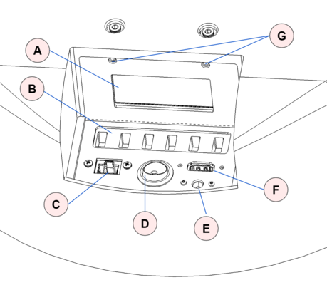
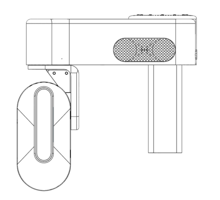
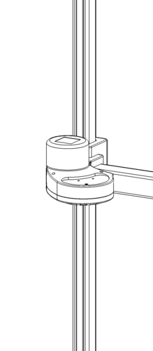
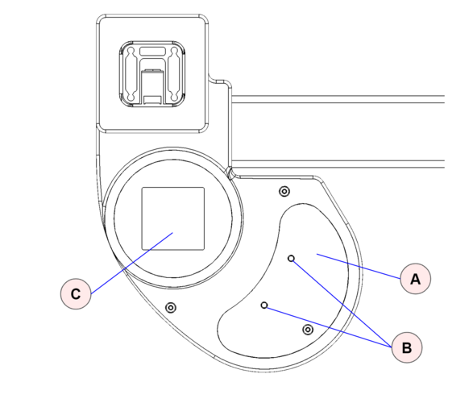
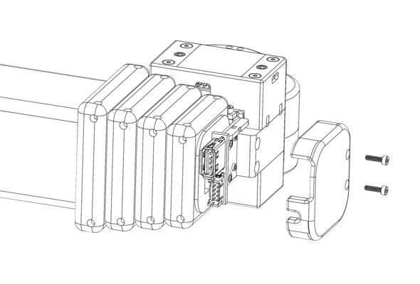

# Hardware User Guide

This manual provides the engineering data relevant to the use of the Hello Robot Stretch RE1 hardware.  

## Disclaimer

The Hello Robot Stretch Robot is intended for use in the research of mobile manipulation applications by users experienced in the use and programming of research robots. This product is not intended for general use in the home by consumers, and lacks the required certifications for such use. Please see the section on   Regulatory Compliance for further details.

## Functional Specification

## Hardware Architecture

## Base

The base is a two wheel differential drive with a passive Mecanum wheel for a caster.  It includes four cliff sensors to allow detection of stairs, thresholds, etc.

<table>
  <tr>
    <td></td>
    <td>Item</td>
    <td>Notes</td>
  </tr>
  <tr>
    <td>A</td>
    <td>Drive wheels</td>
    <td>4 inch diameter, urethane rubber shore 60A</td>
  </tr>
  <tr>
    <td>B</td>
    <td>Cliff sensors</td>
    <td>Sharp GP2Y0A51SK0F, Analog, range 2-15 cm</td>
  </tr>
  <tr>
    <td>C</td>
    <td>Mecanum wheel</td>
    <td>Diameter 50mm</td>
  </tr>
</table>

The base has 6 M4 threaded inserts available for mounting user accessories such as a tray. The mounting pattern is shown below.

### Base IMU

Coming soon.

## Trunk

Development and charge ports are at the back of the base in the trunk. The trunk cover slides into place vertically and is non-latching.

The trunk height has been designed to accommodate one or more USB based Intel Neural Compute Sticks.

Two mounting holes are provided inside the trunk. These allow the user to strain relief tethered cables (eg, HDMI and keyboard) during development. It is recommended to strain relief such cables to prevent accidental damage during base motion.

<table>
  <tr>
    <td></td>
    <td>Item</td>
    <td>Notes</td>
  </tr>
  <tr>
    <td>A</td>
    <td>Vent</td>
    <td>Intake vent for computer fan</td>
  </tr>
  <tr>
    <td>B</td>
    <td>6 Port USB Hub</td>
    <td>USB 3.0 , powered 5V/3A</td>
  </tr>
  <tr>
    <td>C</td>
    <td>Ethernet</td>
    <td>Connected to computer NIC</td>
  </tr>
  <tr>
    <td>D</td>
    <td>On/Off</td>
    <td>Robot power on / off. Switch is illuminated when on.</td>
  </tr>
  <tr>
    <td>E</td>
    <td>Charge</td>
    <td>Rated for upplied 12V/7A charger</td>
  </tr>
  <tr>
    <td>F</td>
    <td>HDMI</td>
    <td>Connected to computer HDMI</td>
  </tr>
  <tr>
    <td>G</td>
    <td>Mounting points</td>
    <td>M4 threaded holes</td>
  </tr>
</table>

## Head

The head provides the audio interface to the robot, a pan tilt depth camera, a runstop, as well as a developer interface to allow the addition of additional user hardware.

<table>
  <tr>
    <td></td>
    <td>Item</td>
    <td>Notes</td>
  </tr>
  <tr>
    <td>A</td>
    <td>Pan tilt depth camera</td>
    <td>Intel RealSense D435i
Two Dynamixel XL430-W250-T servos</td>
  </tr>
  <tr>
    <td>B</td>
    <td>Speakers</td>
    <td></td>
  </tr>
  <tr>
    <td>C</td>
    <td>Mounting holes</td>
    <td>2x M4 threaded, spacing 25mm</td>
  </tr>
  <tr>
    <td>D</td>
    <td>Developer Interface</td>
    <td>USB2.0-A with 5V@500mA fused 
JST XHP-2,  12V@3A fused
Pin 1: 12V
Pin 2: GND</td>
  </tr>
  <tr>
    <td>E</td>
    <td>Microphone array</td>
    <td>With programmable 12 RGB LED ring </td>
  </tr>
  <tr>
    <td>F</td>
    <td>Runstop</td>
    <td></td>
  </tr>
  <tr>
    <td>G</td>
    <td>Audio volume control</td>
    <td></td>
  </tr>
</table>

### Pan Tilt

The head pan-tilt unit utilizes two Dynamixel XL430-W250-T servos. It incorporates a small fan in order to ensure proper cooling of the servo and camera during dynamic repeated motions of the tilt DOF.

The nominal ‘zero’ position is of the head is shown below, along with the corresponding range of motion.

<table>
  <tr>
    <td>DOF</td>
    <td>Range (deg)</td>
    <td>Min(deg)</td>
    <td>Max (deg)</td>
  </tr>
  <tr>
    <td>Pan</td>
    <td>225</td>
    <td>-100 </td>
    <td>125</td>
  </tr>
  <tr>
    <td>Tilt</td>
    <td>115</td>
    <td>-25</td>
    <td>90</td>
  </tr>
</table>

### Runstop

The runstop allows the user to pause the motion of the four primary DOF (base, lift, and arm) by tapping the illuminated button on the head. When the runstop is enabled, these DOF are in a ‘Safety Mode’ that inhibits the motion controller at the firmware level. Disabling the runstop allows normal operation to resume. 

## Lift

The lift degree of freedom provides vertical translation of the arm. It is driven by a closed loop stepper motor, providing smooth and precise motion through a low gear-ratio belt drive. The ‘shoulder’ includes two mounting holes and a small delivery tray.

<table>
  <tr>
    <td></td>
    <td>Item</td>
    <td>Notes</td>
  </tr>
  <tr>
    <td>A</td>
    <td>Delivery tray</td>
    <td></td>
  </tr>
  <tr>
    <td>B</td>
    <td>Mounting holes</td>
    <td>Threaded M4. Spacing 34.5 mm.</td>
  </tr>
  <tr>
    <td>C</td>
    <td>Aruco Tag</td>
    <td>Size 40x40 mm</td>
  </tr>
</table>

## Arm

Coming soon.

## Wrist

### Wrist Accelerometer

Coming soon.

### Expansion USB

The wrist includes a USB 2.0 A interface. This port is fused to 500mA@5V.

### Expansion DIO

The wrist includes an expansion DIO header that provides access to pins of the wrist Arduino board.  The DIO connector can be accessed by removing the cap at the end of the arm.

The header is wired to a Atmel SAMD21G18A-AUT ([datasheet](http://ww1.microchip.com/downloads/en/DeviceDoc/SAM_D21_DA1_Family_DataSheet_DS40001882F.pdf)) microcontroller (same as Arduino Zero). The expansion header pins are configured at the factory to allow:

* General purpose digital I/O
* Analog input

In addition, the firmware can be configured for other pin functions, including:

* Serial SPI
* Serial I2C
* Serial UART

The [Stretch Firmware Manual](https://github.com/hello-robot/stretch_firmware) covers this modification.

**The DIO header pins utilize 3V3 TTL logic. They do not have interface protection (eg, ESD, over-voltage, shorts). It is possible to damage your robot if pin specifications are exceeded **

The pin mapping is:

<table>
  <tr>
    <td>Pin</td>
    <td>Name</td>
    <td>Function</td>
      <td>Factory Firmware</td>
  </tr>
  <tr>
    <td>1</td>
    <td>DGND</td>
    <td>Digital ground</td>
      <td></td>
  </tr>
  <tr>
    <td>2</td>
    <td>3V3</td>
    <td>3.3V supply fused at 250mA.</td>
      <td></td>
  </tr>
    <tr>
    <td>3</td>
    <td>E12V</td>
    <td>12VDC fused at 500mA</td>
        <td></td>
  </tr>
  <tr>
    <td>4</td>
    <td>SS</td>
    <td>DIO | SPI SS </td>
      <td>Digital out (D3)</td>
  </tr>
    <tr>
    <td>5</td>
    <td>SCK</td>
    <td>DIO | SPI SCK</td>
        <td>Digital out (D2)</td>
  </tr>
    <tr>
    <td>6</td>
    <td>MISO</td>
    <td>DIO | SPI MISO |UART TX</td>
        <td>Digital in (D0)</td>
  </tr>
    <tr>
    <td>7</td>
    <td>MOSI</td>
    <td>DIO | SPI MOSI</td>
        <td>Digital in (D1)</td>
  </tr>
    <tr>
    <td>8</td>
    <td>SCL</td>
    <td>DIO | I2C SCL</td>
        <td>Not used</td>
  </tr>
    <tr>
    <td>9</td>
    <td>SS</td>
    <td>DIO | I2C SDA</td>
        <td>Not used</td>
  </tr>
    <tr>
    <td>10</td>
    <td>ANA0</td>
    <td>Analog input | UART RX</td>
        <td>Analog in (A0)</td>
</table>

The expansion DIO uses a 10 pin JST header [B10B-PHDSS(LF)(SN)](https://www.digikey.com/product-detail/en/jst-sales-america-inc/B10B-PHDSS-LF-SN/455-1762-ND/926668).  It is compatible with a [JST PHDR-10VS](https://www.digikey.com/product-detail/en/jst-sales-america-inc/PHDR-10VS/455-1158-ND/608600) housing. JST provides pre-crimped wire compatible with this housing ( part [APAPA22K305](https://www.digikey.com/product-detail/en/jst-sales-america-inc/APAPA22K305/455-3086-ND/6009462)).

Pin 1 & 10 are indicated below.

The expansion DIO schematic shown below.

## Gripper

Coming soon.

# Regulatory Compliance

The Stretch Research Edition 1 (Stretch RE1) is not certified for use as a consumer device in the U.S.

Unless stated otherwise, the Stretch RE1 is not subjected to compliance testing nor certified to meet any requirements, such as requirements for EMI, EMC, or ESD.

Per[ FCC 47 CFR, Part 15, Subpart B, section 15.103(c)](https://www.law.cornell.edu/cfr/text/47/15.103), we claim the Stretch Research Edition 1 as an exempted device, since it is a digital device used exclusively as industrial, commercial, or medical test equipment, where test equipment is equipment intended primarily for purposes of performing scientific investigations.

[OET BULLETIN NO. 62](https://transition.fcc.gov/bureaus/oet/info/documents/bulletins/oet62/oet62rev.pdf), titled "UNDERSTANDING THE FCC REGULATIONS FOR COMPUTERS AND OTHER DIGITAL DEVICES" from December 1993 provides further clarification of the Section 15.103(c) exemption: “*Test equipment* includes devices used for maintenance, research, evaluation, simulation and other analytical or scientific applications in areas such as industrial plants, public utilities, hospitals, universities, laboratories, automotive service centers and electronic repair shops.”

------
.
 All materials are Copyright 2020 by Hello Robot Inc. The Stretch RE1 robot has patents pending
