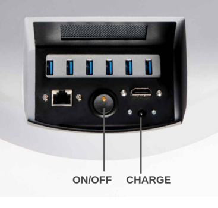
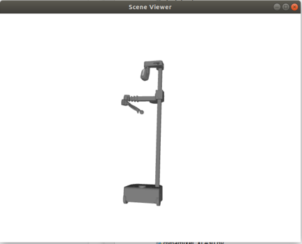

# Stretch RE1: Quick Start Guide

Congratulations on your Stretch RE1! This guide will get you started with your new robot.

We'd welcome your feedback as you get to know your robot. Please let us know of any issues, questions, or points of confusion. Just email us at support@hello-robot.com.

To start, we highly recommend you first go through the [Robot Safety Guide](robot_safety_guide.md) and watch our Robot Safety Video (coming soon).

## Unboxing

Please watch our unboxing video (Coming soon)

## Robot Tour

A few items you'll want to know about before getting started.

### Power

The entire robot powers up and down with the On/Off switch. When powering down, we recommend selecting 'Power Off' from the Ubuntu Desktop prior to hitting the Off switch

The provided battery charger can be plugged and unplugged at any time during operation. We recommend keeping the charger plugged in whenever it isn't running untethered.




#### Runstop

The illuminated button on the head is its Runstop. Just tap it, you'll hear a beep and it will start flashing. This will pause motion of the primary robot joints during operation. This can be useful if the robot makes an unsafe motion, or if you just want to free up the robot motors while you roll it around.

To allow motion once again, hold the button down for two seconds. After the beep, motion can resume.


#### Safe Handling

Like any robot, it is possible to break Stretch if you're not careful. Use common sense when applying forces to its joints, transporting it, etc. 

**Things that won't hurt the robot**:

* Manually push and pull the arm (when the motor isn't holding a position).
* Manually raise and lower the lift (when the motor isn't holding a position).
* Manually roll the base around (when the motors aren't holding a position).
* Pick up and carry Stretch (while holding it by the mast, two people for safety).

**Things to be mindful of**:

* Backdriving the head and wrist. They will backdrive but they want to go at their own speed.

**Things that can hurt the robot**: 

* Driving the wrist and gripper into the base. When the arm and wrist are stowed it is possible to collide the two.
* Getting the gripper stuck on something and then driving the arm, lift, or base. 
* Laying the robot down with it weight on its camera.
* Trying to ride on the robot, getting it wet, etc. (eg, common sense)

## Hello World Demo

Stretch comes ready to run out of the box. The Xbox Teleoperation demo will let you quickly test out the robot capabilities by teleoperating it with an Xbox Controller. 


To start the demo after unboxing:

* Remove the 'trunk' cover and power on the robot

* Wait for about 45 seconds. You will hear the Ubuntu startup sound, followed by two beeps (indicating the demo is running). 

* Hit the Connect button on the controller. The upper two LEDs of the ring will illuminate.

* Hit the Home Robot button. Stretch will go through its homing calibration routine.


 You're ready to go! A few things to try:

* Hit the Stow Robot button. The robot will assume the stow pose.
* Practice driving the robot around. 
* Pull the Fast Base trigger while driving. When stowed, it will make Stretch drive faster
* Manually stop the arm or lift from moving to make it stop upon contact.
* Try picking up your cellphone from the floor 
* Try grasping cup from a counter top
* Try delivering an object to a person

If you're done, hold down the Shutdown PC button for 2 seconds. This will cause the PC to turn off. You can then power down the robot. Or proceed to the next step...


## Get Plugged In

Let's get plugged in.

* Remove the 'trunk' cover and power on the robot if its not already on.
* Plug in a mouse, keyboard and HDMI monitor to the robot trunk
* Plug in the battery charger

Log in to the robot computer. The default user credentials came in the box with the robot. 

Before you can start coding you'll want to first kill off the XBox controller process which runs by default at boot:

```bash
>> pkill -f stretch_xbox*
```

While you're at it, disable this autoboot feature. You can always turn it back on later. 

Search for 'Startup' from Ubuntu Activities. Uncheck the box for 'hello_robot_xbox_teleop' 


## Start Coding

Open up a Terminal. From the command line, first verify that that all of the hardware is present and happy

```
>> stretch_robot_system_check.py
```

You may see a few joints reported in red because they haven't yet been calibrated. If so, home the robot

```
>> stretch_robot_home.py
```

Once the robot has homed, let's write some quick test code:

```
>>ipython
```

Now let's move the robot around using the Robot API. Try typing in these interactive commands at the iPython prompt:

```python
Python 2.7.17 (default, Apr 15 2020, 17:20:14) 
...

import stretch_body.robot
robot=stretch_body.robot.Robot()
robot.startup()

robot.stow()

robot.arm.move_to(0.25)
robot.push_command()

robot.arm.move_to(0.0)
robot.push_command()

robot.lift.move_to(0.4)
robot.push_command()

robot.pretty_print()

robot.lift.pretty_print()

robot.head.pose('tool')
robot.head.pose('ahead')

robot.end_of_arm.move_to('wrist_yaw',0)

robot.end_of_arm.move_to('stretch_gripper',50)
robot.end_of_arm.move_to('gripper',-50)

robot.stow()
robot.stop()
```

#### URDF Visualization

Finally, let's look at the factory calibrated URDF for your robot. From the console run:

```bash
>> stretch_urdf_show.py --motion
```




That's it. Happy coding!

------
.<div align="center"> All materials are Copyright 2020 by Hello Robot Inc. The Stretch RE1 robot has patents pending</div>