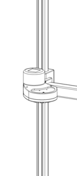

# Robot Safety Guide

Stretch is a potentially dangerous machine with safety hazards. If improperly used it may cause injury or death. We strongly advise all users review the following safety information prior to its operation.

# Intended Use

The Hello Robot Stretch Robot is intended for use in the research of mobile manipulation applications by users experienced in the use and programming of research robots. This product is not intended for general use in the home by consumers, and lacks the required certifications for such use. 

# Safety Hazards

### Stretch Can Topple on to a Person

The robot in motion may drive off stairs or encounter obstacles that cause it to topple over or tumble down on to a person, causing injury. **Operate the robot only on flat surfaces away from stairs or other obstacles that may cause it to topple**.

### Stretch Can Cause Lacerations

The robot wrist and tool has sharp edges that can cause lacerations or punctures to skin or the eyes. **Operate the robot tool away from faces, eyes, and other sensitive body parts**.

### Stretch Can Trap, Crush, or Pinch Body Parts

The robot has moving joints that can trap, crush or pinch hands, fingers, or other body parts. **Keep hands away from designated trap, crush, and pinch points during robot motion.**

### Stretch Can Entrap Loose Clothing or Hair

The robot shoulder has rollers that can pull in and entrap loose clothing or hair. **Keep loose clothing and long hair away from the robot shoulder when it is in motion**.

# Common Sense

The most important aspect of safety with Stretch is to use common sense, including

* Do not operate unattended by an experienced operator
* Exhibit caution when operating around young children who may interact with it in unexpected ways
* Keep an eye on cords, rugs, and any other floor hazards as it drives
* Keep it at least 3 meters from ledges, curbs, stairs, and any other toppling hazard
* Keep long hair and clothes away from the moving components of the robot.
* Do not operate out doors
* Keep the robot dry and do not operate around liquids
* Do not attempt to ride the robot
* If the robot appears to be damaged, stop operation immediately
* Do not have the robot hold any sharp objects.
* Do not attempt to service the robot without supervision by Hello Robot
* Use two people to lift and carry the robot when needed

# Safety Features

We have considered safety from the outset in the design of Stretch. 

* **Runstop**: The illuminated runstop button on Stretch’s head can be used to pause operation of the four primary joints (base, lift, and arm) of the robot when it is in motion. 
* **Lightweight design: ** The overall mass of Stretch is 22Kg, and the majority of the mass is in the base. The carbon fiber arm and aluminum mast make for a remarkably lightweight upper body. While this reduces the risk of crushing, crushing injury can still occur and should be carefully monitored.
* **Gravity friendly**: The arrangement of Stretch’s manipulator means that it doesn’t have to counteract gravity on a larger lever arm. As a result, the motors and gearboxes are much lower torque and lower weight than a traditional robot manipulator, allowing us to avoid the often dangerous strong shoulder joints of robot arms.
* **Low gear ratio**: The primary joints of Stretch (base, lift, and arm) have low, gear-ratios (approx 5:1), allowing for backdriving of joints when powered off. A low gear-ratio also reduces the effective inertia of each joint, limiting the impacted force during undesired contacts with people and the environment.
* **Contact Sensitivity**: The four primary joints of Stretch (base, lift, and, arm) have contact sensitivity. We measure motor currents to estimate contact forces. Because Stretch is a low gear-ratio robot, current sensing provides a fairly sensitive measure of contact forces.
* **Firmware limits**: Motor torques are limited at the lowest level of the firmware to configured bounds.
* **Velocity limits**: Fast motions of the base are restricted when the arm is up high and tool is outside the base footprint. This limits the likelihood of toppling or snagging the tool during base motion.
* **Tilt detection**: The robot can detect when its body is tilted beyond a safe threshold. The robot can be configured to  trigger a runstop event during an over-tilt event.

# Safety Markings

Stretch has the following safety markings:

Top of shoulder, indicating potential pinch point between rollers and mast:

Top of base, indicating potential pinch point between arm and base.

# Runstop

The runstop allows the user to pause the motion of the four primary actuators (base, lift, and arm) by tapping the illuminated button on the head. An experienced operator should always keep the runstop within reach, allowing them to stop the motion of the robot if it is deemed unsafe.

**NOTE: The runstop is not equivalent to an Emergency Stop found on industrial equipment and no safety guarantees are made by its function**.

When the runstop is enabled, these actuators are in a ‘Safety Mode’ that inhibits the motion controller at the firmware level. Disabling the runstop allows normal operation to resume.

The runstop logic is:

<table>
  <tr>
    <td>Action</td>
    <td>Runstop State</td>
    <td>Button Illumination</td>
  </tr>
  <tr>
    <td>Robot startup</td>
    <td>Motion enabled</td>
    <td>Solid</td>
  </tr>
  <tr>
    <td>Tap runstop button</td>
    <td>Motion disabled</td>
    <td>Flashing at 1Hz</td>
  </tr>
  <tr>
    <td>Hold down runstop button for >2s</td>
    <td>Motion enabled</td>
    <td>Solid</td>
  </tr>
</table>

# Safety Hazard Details

### Sharp Edges

Stretch RE1 is a piece of laboratory equipment. As such, its structure has moderately sharp corners edges and corners that can be unsafe. These edges can get snagged during motion, or they may cause lacerations when sufficient force is applied to a person. Care should be taken when grasping or otherwise making contact with Stretch that a sharp corner or edge is not contacted.

### Toppling

Stretch is a relatively lightweight robot. In some kinematic configurations a high center of gravity can make it prone to toppling. Toppling can occur when:

*  The mobile base is moving at moderate or fast speed and it hits a bump, threshold, or other change in floor property
*  If the arm is raised up high and it pushes or pulls on the environment with sufficient force.
*  It drives over a drop-off such as a stair or curb

**NOTE: While the Stretch RE1 has cliff sensors, they do not currently inhibit motion of the base. As such, it is possible for the robot to fall down stairs and hurt itself or a person.**

### Pinch Points

Pinch points around the robot's head, gripper, and wrist can cause discomfort and care should be taken when handling these joints as they move.

The shoulder, which travels up and down on the lift, has a series of rollers that ride along the mast. While the shoulder shells can prevent large objects from getting pinched by the rollers, small and thin objects can be pulled into and crushed. C

Extra care should be taken with long hair, clothing, and small fingers around the shoulder rollers.

### Crush Points

The lift degree of freedom is the strongest joint on the robot and as such can apply potentially unsafe forces to a person.

The lift, while in motion, may trap or crush objects between the ‘shoulder’ and another surface. As such, best practices for lift safety should always be used when using the lift degree of freedom.  

The lift has a max theoretical strength of nearly 200N of linear force. In practice, this force is limited by the lift’s Guarded Move function, which places the lift in Safety Mode when the actuator forces exceed a threshold. Nominally, this threshold is around 70N but it can be configured in software. When enabled an operating as expected, the Guarded Move controller should keep contact forces within comfortable and safe levels. 

The diagrams below show the potential crush points at the top and bottom of the lift range of motion.

It is important for users to keep safety in mind at all times while operating a Hello Robot. When improperly used it is possible for users, bystanders, and property to become harmed. All new users of Hello Robot products should be trained by experienced personnel on best practices for safe operation and interaction with the robot. 

Because Stretch is a mobile manipulator with autonomous capabilities, it may move in unpredictable ways. It may carry potentially dangerous objects that can contact people in unexpected ways. While it is relatively lightweight and able to only exert moderate forces on the environment, dangerous conditions can still occur. 

The moving components of the robot pose dangers of pinching and crushing of body parts. People should always be aware and attentive to the motion and of Stretch robots.

The intended use of the Stretch RE1 is for research and development of mobile manipulation applications within laboratory settings. No robot is ever inherently safe and common sense safety measures should be applied when using Stretch, 
