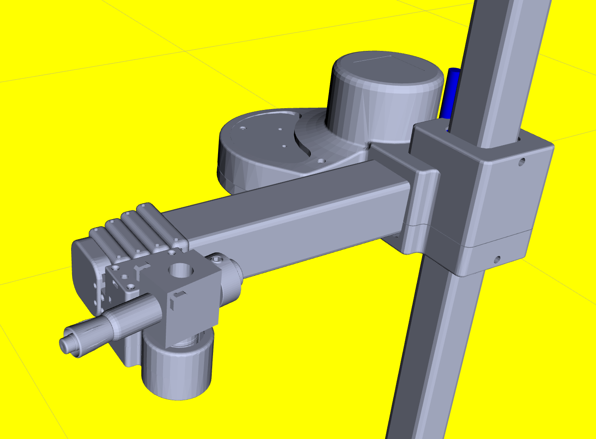

# Stretch RE1: Tool Change Tutorial

Many users will want to work with tools other than the default Stretch Gripper that ships with the robot. In this tutorial you will learn how to configure the Stretch software interfaces to support other tools.

# Changing Tools in Stretch Body

Stretch Body v0.1.0 and later support a plug-in based interface to tools. A tool is an extension of the [EndOfArm]() class that supports additional degrees of freedom. 

## Standard Tools

Stretch Body supports two tools by default: The [ToolNone & ToolStretchGripper](https://github.com/hello-robot/stretch_body/tree/master/body/end_of_arm_tools.py). We will explore swapping between these default tools.

### ToolStretchGripper

The ToolStretchGripper is the default tool that ships with the RE1. This default tool is loaded according to the `stretch_re1_user_params.yaml` field:

```yaml
robot:
  tool: tool_stretch_gripper
```

We can interact with this tool from Python

```python
In [1]: import stretch_body.robot as robot
In [2]: r=robot.Robot()
In [3]: r.startup()

In [4]: r.end_of_arm
Out[4]: <stretch_body.end_of_arm_tools.ToolStretchGripper instance at 0x7f99109155a0>

In [5]: r.end_of_arm.motors
Out[5]: 
{'stretch_gripper': <stretch_body.stretch_gripper.StretchGripper instance at 0x7f99109159b0>,
 'wrist_yaw': <stretch_body.wrist_yaw.WristYaw instance at 0x7f9910915820>}

In [6]: r.end_of_arm.stow()
--------- Stowing Wrist Yaw ----
--------- Stowing Gripper ----
In [7]: r.stop()
```

### ToolNone

The ToolNone interface to the end-of-arm should be selected when no tool is attached to the Wrist Yaw joint.  To switch to this interface, simply update the field in your `stretch_re1_user_params.yaml` to:

```yaml
robot:
  tool: tool_none
```

After updating the YAML we can interact with the ToolNone via iPython

```python
In [1]: import stretch_body.robot as robot
In [2]: r=robot.Robot()
In [3]: r.startup()
In [4]: r.end_of_arm
Out[4]: <stretch_body.end_of_arm_tools.ToolNone instance at 0x7f245f786fa0>

In [5]: r.end_of_arm.motors
Out[5]: {'wrist_yaw': <stretch_body.wrist_yaw.WristYaw instance at 0x7f245e69e410>}

In [6]: r.end_of_arm.stow()
--------- Stowing Wrist Yaw ----
In [7]: r.stop()
```


## Using Tools from the Stretch Tool Share

The [Stretch Tool Share](https://github.com/hello-robot/stretch_tool_share/) is an open Git repository for non-standard RE1 tools. It hosts both the CAD, URDF, and Python files needed to integrate these tools onto your robot.

**NOTE**:  Only select tools hosted on the Tool Share include URDF and Python data.

To use Stretch Tool Share tools, first update your installation:

```bash
pip2 install hello-robot-stretch-tool-share
```

We can see on the Tool Share that there is a tool, the [ToolDryEraseToolHolderV1]()) which [extends the EndOfArm](https://github.com/hello-robot/stretch_tool_share/blob/master/python/stretch_tool_share/usbcam_wrist_v1/tool.py) class. In order to select this tool interface , modify your `stretch_re1_user_params.yaml` to load the tool as before. We will also need to tell it where to find the tool's [parameter file]():

```yaml
robot:
  tool: tool_dry_erase_holder_v1
params:
- stretch_tool_share.dry_erase_holder_v1.params
```

We can now interact with this Tool Share tool:

```python
In [1]: import stretch_body.robot as robot

In [2]: r=robot.Robot()

In [3]: r.startup()

In [4]: r.end_of_arm
Out[4]: <stretch_tool_share.dry_erase_holder_v1.tool.ToolDryEraseHolderV1 instance at 0x7f3b61c17f00>

In [5]: r.end_of_arm.motors
Out[5]: {'wrist_yaw': <stretch_body.wrist_yaw.WristYaw instance at 0x7f3b61c59280>}

In [6]: r.end_of_arm.stow()
--------- Stowing Wrist Yaw ----

```


# Changing Tools in Stretch ROS

Next we'll show how to change the ROS interface for a tool. As an example, we will load the [ToolDryEraseHolderV1]() and visualize it in RViz. First, configure Stretch Body to use the tool as in the previous exercise. 

Next, ensure your ROS is up to date:

```bash
>>$ cd ~/catkin_ws/src/stretch_ros/
>>$ git pull
```

To access the URDF data for the [ToolDryEraseHolderV1]() we'll need to clone the Tool Share repository:

```bash
>>$ cd ~/repos
>>$ git clone https://github.com/hello-robot/stretch_tool_share
```

Copy in the tool's URDF data into the Stretch ROS repository:

```bash
>>$ cd ~/repos/stretch_tool_share/tool_share/dry_erase_holder_v1
>>$ cp stretch_description/urdf/*.xacro ~/catkin_ws/src/stretch_ros/stretch_description/urdf/
>>$ cp stretch_description/meshes/*.STL ~/catkin_ws/src/stretch_ros/stretch_description/meshes/
```

Now we will update the tool Xacro for Stretch. Open the file `~/catkin_ws/src/stretch_ros/stretch_description/urdf/stretch_description.xacro` in an editor. Comment out the current tool Xacro and include the Xacro for the dry erase holder.

```xml
<?xml version="1.0"?>
<robot xmlns:xacro="http://www.ros.org/wiki/xacro" name="stretch_description">

  <!--<xacro:include filename="stretch_gripper.xacro" />-->
  <xacro:include filename="stretch_dry_erase_marker.xacro" />
    
  <xacro:include filename="stretch_main.xacro" />
  <xacro:include filename="stretch_aruco.xacro" />
  <xacro:include filename="stretch_d435i.xacro" />
  <xacro:include filename="stretch_laser_range_finder.xacro" />
  <xacro:include filename="stretch_respeaker.xacro" />
</robot>
```

Finally, we'll update our already calibrated URDF to use this new tool:

```bash
>>$ cd ~/catkin_ws/src/stretch_ros/stretch_description/urdf
>>$ cp stretch.urdf stretch.urdf.bak
>>$ rosrun stretch_calibration update_urdf_after_xacro_change.sh
```

Ctrl-C when the `rosrun` command terminates and you're ready to visualize the tool in RViz:

```bash
>>$ roslaunch stretch_calibration simple_test_head_calibration.launch
```



# Advanced Topics

## Understanding How the Tool Plug-In Works

For users looking to create their own custom tools it can be useful to understand how the tool plug-in architecture works. Here we will walk through the basics of the system for both Stretch Body and Stretch ROS

### Stretch Body

The [Robot]() class expects an instance of EndOfArm tool to be present. The EndOfArm tool is an extension of the [DynamixelXChain](), which manages a chain of Dynamixel servos.

The  EndOfArm tool base class is configured to control just the [WristYaw] DOF. We can extend this base class to include additional DOFs, such as the Stretch Gripper. We see this in the [ToolStretchGripper]() class:

```python
class ToolStretchGripper(EndOfArm):
    def __init__(self, name='tool_stretch_gripper'):
        EndOfArm.__init__(self,name)

    def stow(self):
        # Fold in wrist and gripper
        print('--------- Stowing Wrist Yaw ----')
        self.move_to('wrist_yaw', self.params['stow']['wrist_yaw'])
        print('--------- Stowing Gripper ----')
        self.move_to('stretch_gripper', self.params['stow']['stretch_gripper'])
```

The parameters for ToolStretchGripper are defined in [robot_params.py](). These parameters tell the plug-in which DynamixelHelloXL430 instances to load and manage. 

```python
"tool_stretch_gripper": {
    'use_group_sync_read': 1,
    'retry_on_comm_failure': 1,
    'baud':115200,
    'verbose':0,
    'py_class_name': 'ToolStretchGripper',
    'py_module_name': 'stretch_body.end_of_arm_tools',
    'stow': {'stretch_gripper': 0, 'wrist_yaw': 3.4},
    'devices': {
        'stretch_gripper': {
            'py_class_name': 'StretchGripper',
            'py_module_name': 'stretch_body.stretch_gripper'
        },
        'wrist_yaw': {
            'py_class_name': 'WristYaw',
            'py_module_name': 'stretch_body.wrist_yaw'
        }
    }
},
```

 As usual, these parameters can be overridden in the `stretch_re1_user_params.yaml`. For example to change the baddrate for the chain of servos:

```yaml
tool_stretch_gripper:
  baud: 57600
```

For tools that are not a part of Stretch Body, such as from the ToolShare, you must include the tool parameters as well in your  `stretch_re1_user_params.yaml`. A robot that must support many tools may have user YAML that looks like:

```yaml
params:
- stretch_tool_share.usbcam_wrist_v1.params
- stretch_tool_share.stretch_dex_wrist_beta.params
- stretch_tool_share.dry_erase_holder_v1.params
robot:
  tool: tool_dry_erase_holder_v1
  #tool: tool_none
  #tool: tool_stretch_gripper
  #tool: tool_usbcam_wrist_v1
  #tool: tool_stretch_dex_wrist_beta
tool_stretch_dex_wrist:
  baud: 115200
tool_stretch_gripper:
  baud: 57600
```

It is possible to define a 'stow' posture for each tool. As seen above in the  [robot_params.py](), the posture is defined as

```python
'stow': {'stretch_gripper': 0, 'wrist_yaw': 3.4},
```

Now,  `robot.stow( )` will call `robot.end_of_arm.stow( )`which in turn can call a custom stowing behavior. For the Stretch Gripper it is found in `ToolStretchGripper.stow()` as:

```python
...
    def stow(self):
        # Fold in wrist and gripper
        print('--------- Stowing Wrist Yaw ----')
        self.move_to('wrist_yaw', self.params['stow']['wrist_yaw'])
        print('--------- Stowing Gripper ----')
        self.move_to('stretch_gripper', self.params['stow']['stretch_gripper'])
```

For a more complex implementation of a tool we recommend reviewing the [Stretch Dex Wrist] implementation on the Stretch Tool Share. 

### Stretch ROS 

x