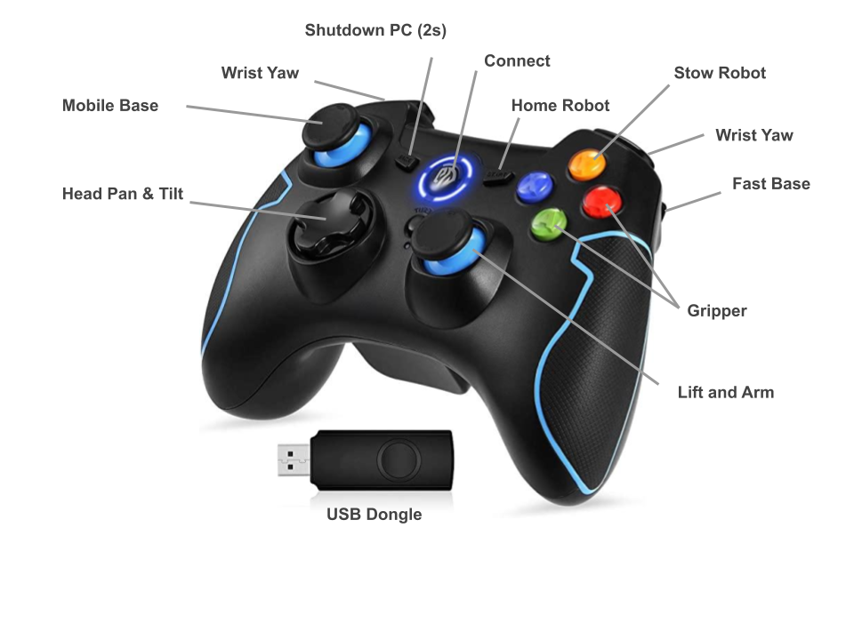
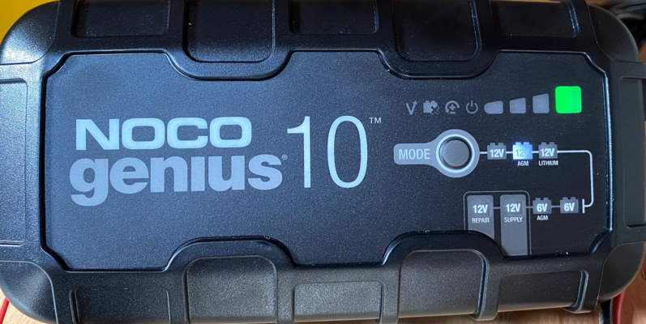
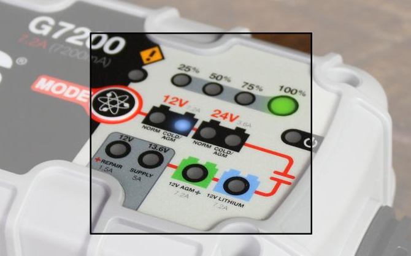
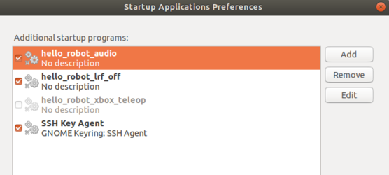

# Stretch RE1: Troubleshooting Guide

This guide covers common issues and ways to resolve them. Please check the [Hello Robot Forum](forum.hello-robot.com) for additional topics not covered here.

## XBox teleoperation is not working 

The provided Easy SMX wireless controller can accidentally be placed in the wrong mode. The mode is indicated by the round illuminated ring (shown as Connect below). The top 2 LEDs only should be illuminated. If a different LED pattern is shown then the button mapping expected by [stretch_xbox_controller_teleop.py](https://github.com/hello-robot/stretch_body/blob/master/tools/bin/stretch_xbox_controller_teleop.py0) will be incorrect.

To set the controller into the correct mode:

- Hold the center button down for 5s. It will switch modes. Release.
- Repeat until top half of ring (upper two lights) are illuminated.

In addition, check that the provided USB dongle is plugged into the robot USB port in its trunk.

. 



## Battery is not staying charged

When fully charged, Stretch should have a battery life of about 2 hours while running a heavy CPU load. The battery may not stay charged if:

* The battery gets drained to a level beyond which the charger can recover from
* The battery charger is set to the wrong charge mode

Stretch utilizes [12V AGM SLA batteries](https://www.power-sonic.com/product/ps-1290/). It currently ships with a NOCO Genius 10 charger. Earlier 'Guthrie' versions of Stretch use the NOCO G7200. These two chargers are functionally very similar.

Please review the battery charger user manuals prior to following the guidance below:

* [Genius10](https://no.co/media/nocodownloads/format/g/e/genius10na_user_guide_1.pdf)
* [G7200](https://no.co/media/nocodownloads/format/g/7/g7200_manual_english_1.pdf)

The charger supports a number of charging modes. The relevant ones for Stretch are:

| Mode       | Function                                                     |      |
| ---------- | ------------------------------------------------------------ | ---- |
| 12V AGM    | Normal charging mode for Stretch. Default mode as shipped with robot. |      |
| 12V REPAIR | Repairs damaged and deep discharged batteries.               |      |
| 12V SUPPLY | Acts as a 12V power supply, allowing the robot to recover from deep discharge and to also be powered without discharging the batteries. |      |

### Changing Modes

Pressing the charger Mode button will toggle it through its modes. The 'advanced' charging modes are only accessible by first holding down the Mode button for 3-5 seconds.

The charger will remember its charge mode when unpowered. 

**Note: When changing charger modes, first disconnect the charger from the robot.**

### Normal Operation

During normal use the charger should be in 12V AGM Mode. As shown below, the 12V AGM indicator will be illuminated. When the battery is fully charged, the green 100% indicator will be on.

The charger is in 12V AGM mode when shipped with Stretch. If your battery is not charging, first check that it wasn't accidentally placed in another mode.






### Recovering Drained Batteries

If Stretch is left powered up without the charger attached it is possible to fully discharge the batteries. In this case, the 12V AGM mode may not be able to recover the charge. In this case:

* Attach the charger
* Press and hold the Mode button for 3 seconds, allowing the charger to access the Advanced modes
* Push the Mode button a few times until it is in 12V Supply mode
* Allow robot to charge for at least 1 hour
* Place the charger back in 12V AGM mode and allow batteries to charger to 100%
* Boot the robot up with the charger unattached. 
* Check the battery voltage by running `stretch_robot_battery_check.py`. The reported voltage should be >=12V 

### Repairing Damaged Batteries

It is possible for Stretch's batteries to become damaged due to repeated deep discharge. If the robot has continued issues maintaining a charge we recommend attempting the following procedure: 

1. Power off the robot and plug in the charger
2. Press and hold the Mode button for 3 seconds, allowing the charger to access the Advanced modes
3. Push the Mode button a few times until it is in 12V REPAIR mode
4. Allow robot to charge for at least 4 hours
5. Place the charger back in 12V AGM mode and allow batteries to charger to 100%
6. Boot the robot up with the charger unattached. 
7. Check the battery voltage by running `stretch_robot_battery_check.py`. The reported voltage should be >=12V 

## RPC Transport Errors (Stretch doesn't respond to commands)

If more than one instance of Stretch Body's [Robot](https://github.com/hello-robot/stretch_body/blob/master/body/stretch_body/robot.py) class is instantiated at a time, Stretch Body will report communication errors and will not always execute motion commands as expected. This is because [Robot](https://github.com/hello-robot/stretch_body/blob/master/body/stretch_body/robot.py)  manages communications with the robot hardware and it doesn't support multiple writes to the USB devices.

These errors can appear as

```
Transport RX Error on RPC_ACK_SEND_BLOCK_MORE False 0 102
---- Debug Exception
--------------- New RPC -------------------------
Framer sent RPC_START_NEW_RPC
...
```

or as

```
IOError(None): None
...
```

To check if a instance of [Robot](https://github.com/hello-robot/stretch_body/blob/master/body/stretch_body/robot.py) is already instantiated, you may use the Unix [top](https://www.unixtutorial.org/commands/top) command to monitor active processes. You may use the Unix [pkill](https://linuxize.com/post/pkill-command-in-linux/) command to end the background instance of Robot.

As shipped, Stretch launches [stretch_xbox_controller_teleop.py](https://github.com/hello-robot/stretch_body/blob/master/tools/bin/stretch_xbox_controller_teleop.py) upon boot. It is necessary to turn off this automatic launch feature, otherwise your own Robot instance will conflict with this script. Additionally, if you are logged into multiple accounts, a Robot instance may be active in another user account.

To turn it off, search for 'Startup' from Ubuntu Activities. Uncheck the box for 'hello_robot_xbox_teleop'.





